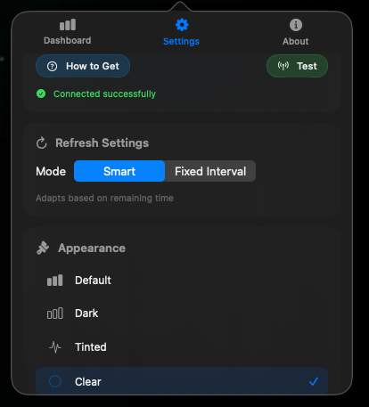
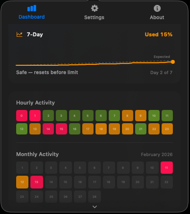
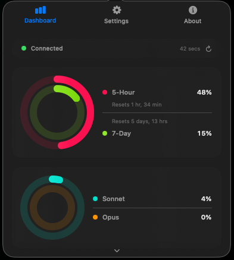

<div align="center">

<!-- PLACEHOLDER: assets/icon.png — App icon (120x120), the macOS app icon or a custom logo -->


# Claude Usage Tracker

**Real-time usage monitoring for Claude AI, right in your macOS menu bar.**

[](https://www.apple.com/macos/)
[](https://swift.org)
[](https://developer.apple.com/xcode/swiftui/)
[](LICENSE)
[](https://github.com/MeshVSC/claude-usage-tracker/pulls)

<br />

<!-- PLACEHOLDER: assets/screenshot-dashboard.png — Full app popover showing the Dashboard tab (rings, pace card, burn rate, heatmap) -->


<br />

[Features](#features) &bull; [Installation](#installation) &bull; [Setup](#setup) &bull; [How It Works](#how-it-works) &bull; [Contributing](#contributing) &bull; [License](#license)

</div>

---

## Features

<table>
<tr>
<td width="50%">

### Activity Rings
Apple Watch-inspired concentric rings showing your 5-hour and 7-day usage at a glance. Separate rings for Sonnet and Opus model breakdown.

</td>
<td width="50%">

### Visual Pace Indicator
See exactly where you are vs. where you should be in your 7-day budget. Big numbers, a progress bar, and a clear ahead/behind indicator — no mental math needed.

</td>
</tr>
<tr>
<td width="50%">

### Burn Rate Projection
5-hour window shown as filling squares, 7-day window as a stock-chart sparkline with an expected pace dotted line. Color-coded green/orange/red based on your actual pace.

</td>
<td width="50%">

### Smart Alerts
macOS notifications at 80% and 95% thresholds on both the 5-hour and 7-day windows. Never get caught off guard by a rate limit again.

</td>
</tr>
<tr>
<td width="50%">

### Activity Heatmap
Tracks when you use Claude most. A 24-hour grid builds over time showing your usage patterns by hour of day, color-coded by intensity.

</td>
<td width="50%">

### Menu Bar Indicator
See your usage percentage without opening the popover. Choose which metrics to display — 5-hour, 7-day, Sonnet, or Opus — all configurable in settings.

</td>
</tr>
</table>

---

## At a Glance

| Feature | Status |
|:--------|:------:|
| Real-time usage tracking |  |
| Apple Activity Rings (5h + 7d) |  |
| Model breakdown (Sonnet + Opus) |  |
| 7-Day pace indicator |  |
| Burn rate with sparkline chart |  |
| Smart alerts (80% / 95%) |  |
| Usage heatmap |  |
| Menu bar indicator |  |
| Configurable refresh (Smart / Fixed) |  |
| Launch at Login |  |
| Appearance themes |  |
| Extra usage / overage alerts |  |

---

## Installation

### Requirements

- macOS 13.0 (Ventura) or later
- A Claude Pro, Team, or Enterprise subscription

### Download

> **Coming soon** — Releases will be available on the [Releases](https://github.com/MeshVSC/claude-usage-tracker/releases) page.

### Build from Source

```bash
git clone https://github.com/MeshVSC/claude-usage-tracker.git
cd claude-usage-tracker/ClaudeUsageTracker-Xcode
open ClaudeUsageTracker.xcodeproj
```

Build and run with **Cmd + R** in Xcode 15+.

---

## Setup

1. **Open Claude.ai** in your browser and log in
2. **Open Developer Tools** — Press `Option + Cmd + I`
3. **Go to the Network tab** and refresh the page
4. **Find any request** to `claude.ai` and look in the **Cookie** header
5. **Copy the `sessionKey` value**
6. **Paste it into the app** in Settings > Authentication and click **Test**

<!-- PLACEHOLDER: assets/screenshot-settings.png — Full app popover showing the Settings tab (auth, refresh, menu bar display, appearance, general) -->
<div align="center">

</div>

---

## How It Works

Claude Usage Tracker connects to the same API that Claude.ai uses to display your usage information. It periodically fetches your utilization data and presents it visually.

### Data Sources

| Endpoint | Data |
|:---------|:-----|
| `/api/organizations/{id}/usage` | 5-hour, 7-day, Sonnet, Opus utilization + reset times |
| `/api/organizations/{id}/overage_spend_limit` | Plan limits, credit balance, overage status |

### Refresh Modes

- **Smart** — Adapts polling frequency based on remaining budget (30s when critical, 10min when comfortable)
- **Fixed** — Choose a fixed interval: 5, 10, 15, 20, or 30 minutes

### Privacy

- Your session key is stored **locally** in macOS UserDefaults
- No data is sent to any third-party server
- All usage data stays on your machine
- The app only communicates with `claude.ai`

---

## Screenshots

<!--
SCREENSHOTS NEEDED (place in assets/ folder):

1. assets/screenshot-dashboard.png  — Full app popover, Dashboard tab visible
   Shows: Activity rings, pace card, burn rate squares + sparkline, heatmap, header row

2. assets/screenshot-settings.png   — Full app popover, Settings tab visible
   Shows: Auth card, refresh settings, menu bar display toggles, appearance themes, general

3. assets/screenshot-about.png      — Full app popover, About tab visible
   Shows: App header, feature grid, Mesh Studios card, support links, license

4. assets/screenshot-menubar.png    — Cropped macOS menu bar area
   Shows: The app icon + usage percentage text in the macOS menu bar
-->
<div align="center">
<table>
<tr>
<td align="center"><br /><sub>Dashboard</sub></td>
<td align="center"><br /><sub>Settings</sub></td>
</tr>
<tr>
<td align="center"><br /><sub>About</sub></td>
<td align="center"><br /><sub>Menu Bar</sub></td>
</tr>
</table>
</div>

---

## Tech Stack

- **SwiftUI** — Native macOS UI framework
- **Combine** — Reactive data binding
- **UserNotifications** — Smart alerts
- **ServiceManagement** — Launch at Login
- **URLSession** — API communication

---

## Contributing

Contributions are welcome. Please open an issue first to discuss what you would like to change.

1. Fork the repository
2. Create your feature branch (`git checkout -b feature/amazing-feature`)
3. Commit your changes
4. Push to the branch
5. Open a Pull Request

---

## License

Distributed under the **MIT License**. See [`LICENSE`](LICENSE) for more information.

---

<div align="center">

**Built by [Mesh Studios](https://github.com/MeshVSC)** &bull; Barcelona, Spain &bull; 2026

<sub>Promoting transparency and democratizing AI usage monitoring.</sub>

</div>
